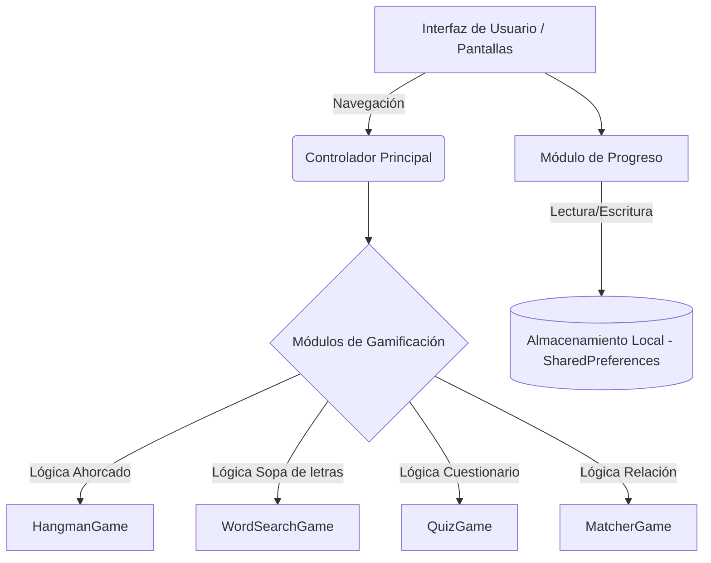

# Tics en la literatura 📚

  

Aplicación móvil educativa y gamificada desarrollada en Flutter, cuyo objetivo principal es fomentar el aprendizaje de la literatura universal e hispanoamericana mediante la integración de recursos interactivos. La plataforma proporciona un entorno lúdico, facilitando a los usuarios el repaso de obras clásicas como *La Ilíada*, *La Odisea*, *La Eneida*, *Las cruces sobre el agua* y *Cien años de soledad*.

**Prueba en vivo:** Puedes interactuar directamente con la aplicación en [luisknight24.github.io/AppUsoTic/](https://luisknight24.github.io/AppUsoTic/).

*Nota: Este no es un despliegue web tradicional, sino el motor gráfico de Flutter compilado nativamente para navegadores. Permite probar la interfaz y mecánicas exactas sin instalaciones previas.*

**Descarga móvil:** Para probar el rendimiento nativo del sistema en dispositivos Android, el instalador empaquetado `.apk` se encuentra disponible públicamente en la pestaña de [Releases](https://github.com/luisknight24/AppUsoTic/releases).

---

## Arquitectura del sistema

El proyecto está diseñado bajo una arquitectura modular orientada a componentes en Flutter, separando claramente la lógica de los minijuegos, la gestión de estado y la interfaz de usuario.



## Componentes principales

- **Frontend (UI Flutter):** Ofrece una interfaz de usuario adaptativa y optimizada en un tema oscuro (OLED/Vantablack). Incluye un recorrido paso a paso para nuevos usuarios (Tutorial), optimizando la curva de aprendizaje inicial.
- **Módulos multimedia:** Dispone de secciones con sinopsis literarias y reproductores de YouTube integrados para la visualización de material audiovisual complementario de cada obra.
- **Motor de Gamificación:** Integra cuatro mecánicas independientes y escalables diseñadas para evaluar y reforzar el conocimiento adquirido.
- **Gestor de Persistencia (Local Storage):** Emplea `SharedPreferences` para guardar de manera persistente los récords de cada jugador en el dispositivo, permitiendo consultar los mejores desempeños a través de un panel de trofeos dedicado sin necesidad de conexión a servidores externos.

## Dinámicas interactivas y métricas

La evaluación de conocimientos se realiza a través de cuatro dinámicas principales:

| Minijuego | Objetivo mecánico | Enfoque de aprendizaje |
| :--- | :--- | :--- |
| **Sopa de letras** | Búsqueda de patrones en cuadrícula bidimensional. | Retención de vocabulario y nombres clave. |
| **Ahorcado literario** | Adivinanza de palabras mediante selección de letras. | Refuerzo ortográfico y recuerdo de personajes. |
| **Cuestionario** | Selección múltiple con temporizador y puntaje. | Comprensión lectora y detalles de la trama. |
| **Relación de citas** | Conexión de conceptos o frases literarias. | Análisis de contexto y comprensión semántica. |

## Estructura del repositorio

```text
AppUsoTic/
├── lib/
│   ├── main.dart                 # Punto de entrada de la aplicación y configuración de tema
│   ├── games/                    # Lógica y vistas de las dinámicas interactivas
│   │   ├── hangman_game.dart     # Módulo del Ahorcado
│   │   ├── matcher_game.dart     # Módulo de Relación
│   │   ├── quiz_game.dart        # Módulo de Cuestionario
│   │   └── word_search_game.dart # Módulo de Sopa de Letras
│   ├── models/                   # Estructuras de datos
│   │   └── book.dart             # Modelo de las obras literarias
│   └── screens/                  # Interfaz de usuario principal
│       ├── book_details.dart     # Pantalla de detalles y multimedia
│       ├── dashboard.dart        # Menú principal y selector de libros
│       ├── splash_screen.dart    # Pantalla de carga inicial
│       └── tutorial_screen.dart  # Flujo de bienvenida
```

## Instalación y ejecución local

ℹ️ *Nota: Se requiere contar con el SDK de Flutter instalado y configurado en las variables de entorno antes de iniciar.*

**1. Clonar el repositorio**
```bash
git clone https://github.com/luisknight24/AppUsoTic.git
cd AppUsoTic
```

**2. Instalar dependencias**
Descarga los paquetes necesarios declarados en `pubspec.yaml`:
```bash
flutter pub get
```

**3. Ejecutar la aplicación**
Levanta la aplicación en un emulador activo o dispositivo físico conectado:
```bash
flutter run
```

*Advertencia: Para el correcto funcionamiento de los videos embebidos en la interfaz, el dispositivo cliente debe contar con una conexión a internet activa.*
